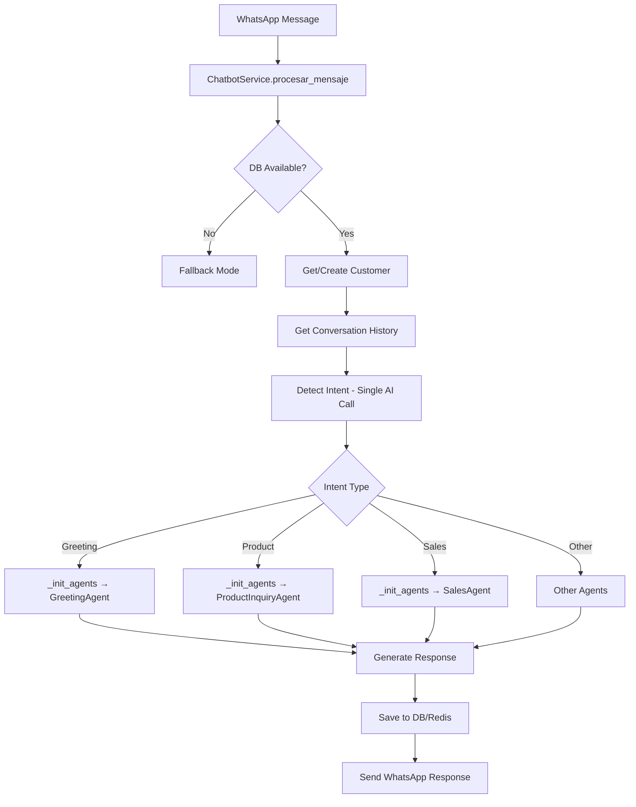
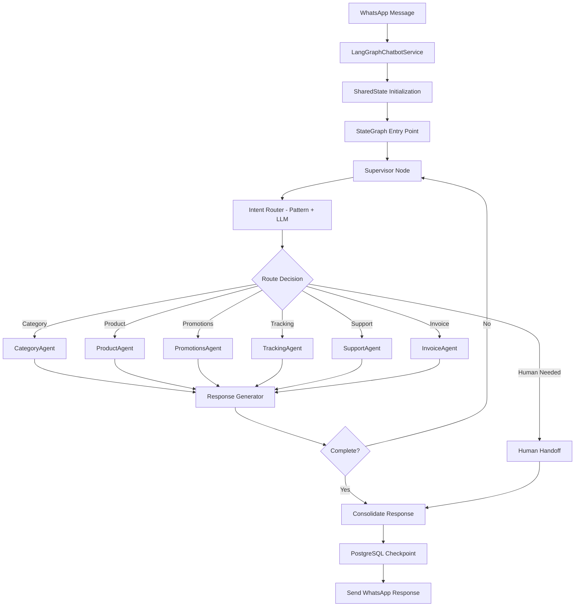

# Arquitectura LangGraph vs Sistema Tradicional

## 🔄 Comparación de Flujos

### Flujo Tradicional (ChatbotService)



**Características del flujo tradicional:**
- Procesamiento lineal y secuencial
- Un solo agente procesa cada mensaje
- Cambio de contexto manual entre agentes
- Estado almacenado externamente (Redis/DB)
- Decisiones hardcodeadas en cada paso

### Flujo LangGraph (Multi-Agente)



## 🚀 Ventajas del Sistema LangGraph

### 1. **Arquitectura Modular y Escalable**

**Tradicional:**
```python
# Agentes acoplados al servicio principal
class ChatbotService:
    def _init_agents(self):
        self.greeting_agent = GreetingAgent()
        self.product_agent = ProductInquiryAgent()
        # Difícil agregar nuevos agentes
```

**LangGraph:**
```python
# Agentes independientes y desacoplados
self.agents = {
    "category_agent": CategoryAgent(...),
    "product_agent": ProductAgent(...),
    # Fácil agregar nuevos agentes
}
```

### 2. **Gestión de Estado Avanzada**

**Tradicional:**
- Estado fragmentado entre Redis, DB y memoria
- Sincronización manual compleja
- Pérdida de contexto entre llamadas

**LangGraph:**
- Estado unificado con `SharedState`
- Checkpointing automático con PostgreSQL
- Recuperación automática de conversaciones
- Histórico completo de estados

### 3. **Routing Inteligente Multi-Estrategia**

**Tradicional:**
```python
# Detección simple basada en palabras clave
if "laptop" in message:
    return UserIntent.CONSULTA_PRODUCTO
```

**LangGraph:**
```python
# Detección híbrida: Patrones + LLM + Contexto
intent_info = IntentRouter.analyze_intent(state)
# - Pattern matching rápido
# - LLM para casos complejos
# - Extracción de entidades
# - Análisis de confianza
```

### 4. **Flujo de Conversación Dinámico**

**Tradicional:**
- Flujo lineal: un mensaje → una respuesta
- Sin capacidad de volver atrás
- Difícil manejar conversaciones complejas

**LangGraph:**
- Flujo cíclico con supervisión
- Múltiples agentes pueden colaborar
- Capacidad de re-evaluar decisiones
- Transiciones condicionales inteligentes

### 5. **Manejo de Errores Robusto**

**Tradicional:**
```python
try:
    response = agent.process(message)
except:
    return "Error genérico"
```

**LangGraph:**
```python
# Sistema de fallback en cascada
- Error tracking por agente
- Fallback automático a otros agentes
- Transferencia humana inteligente
- Límites configurables (max_errors)
```

### 6. **Integración con Servicios Externos**

**Tradicional:**
- Conexiones directas en cada agente
- Duplicación de código
- Difícil testear

**LangGraph:**
- Integraciones centralizadas
- Ollama para LLM
- ChromaDB para vectores
- PostgreSQL para persistencia
- Health checks integrados

### 7. **Observabilidad y Monitoreo**

**Tradicional:**
- Logs básicos
- Sin métricas de rendimiento
- Debug difícil

**LangGraph:**
```python
# Sistema de monitoreo completo
- Performance metrics por agente
- Tracking de decisiones
- Historial de agentes involucrados
- Context summary automático
```

### 8. **Capacidades Avanzadas**

#### Multi-Turn Conversations
- El sistema puede mantener conversaciones largas sin perder contexto
- Hasta 20 intercambios con memoria completa
- Re-evaluación de intenciones en cada turno

#### Entity Extraction
```python
entities = {
    "order_numbers": ["#12345"],
    "price_mentions": [1500.00],
    "brands": ["dell", "hp"],
    "technical_specs": {"ram_gb": 16, "storage": "512gb"}
}
```

#### Handoff Intelligence
- Detección automática de situaciones que requieren humano
- Preparación de contexto para el agente humano
- Transferencia suave sin pérdida de información

### 9. **Rendimiento y Eficiencia**

**Tradicional:**
- Una llamada AI por mensaje
- Procesamiento secuencial
- Sin caché de decisiones

**LangGraph:**
- Pattern matching antes de LLM (ahorro de recursos)
- Procesamiento paralelo de agentes
- Caché de embeddings en ChromaDB
- Reutilización de contexto

### 10. **Testing y Mantenimiento**

**Tradicional:**
- Testing complejo por acoplamiento
- Difícil simular escenarios
- Cambios afectan todo el sistema

**LangGraph:**
- Agentes testeables independientemente
- StateGraph permite simulación de flujos
- Health checks por componente
- Modo sin checkpointer para tests

## 📊 Comparación de Capacidades

| Característica | Sistema Tradicional | LangGraph |
|----------------|-------------------|-----------|
| Arquitectura | Monolítica | Multi-agente modular |
| Gestión de Estado | Externa (Redis/DB) | Integrada con checkpointing |
| Routing | Hardcoded | Inteligente (Pattern + LLM) |
| Escalabilidad | Limitada | Alta |
| Manejo de Errores | Básico | Avanzado con fallbacks |
| Observabilidad | Logs | Métricas completas |
| Conversaciones largas | Difícil | Nativo |
| Entity Extraction | Manual | Automática |
| Human Handoff | Manual | Inteligente |
| Testing | Complejo | Modular |

## 🔧 Casos de Uso Ideales

### Sistema Tradicional
- Bots simples con flujos predefinidos
- Respuestas rápidas sin contexto
- Proyectos pequeños con pocos agentes

### LangGraph
- Asistentes complejos multi-dominio
- Conversaciones largas con contexto
- Sistemas que requieren escalabilidad
- Integración con múltiples servicios
- Necesidad de observabilidad avanzada

## 🚀 Migración Recomendada

1. **Fase 1**: Implementar LangGraph en paralelo
2. **Fase 2**: Migrar agentes uno por uno
3. **Fase 3**: Activar checkpointing PostgreSQL
4. **Fase 4**: Desactivar sistema tradicional
5. **Fase 5**: Optimizar y expandir capacidades

El sistema LangGraph representa una evolución significativa en la arquitectura de chatbots, proporcionando una base sólida para construir asistentes conversacionales sofisticados y escalables.