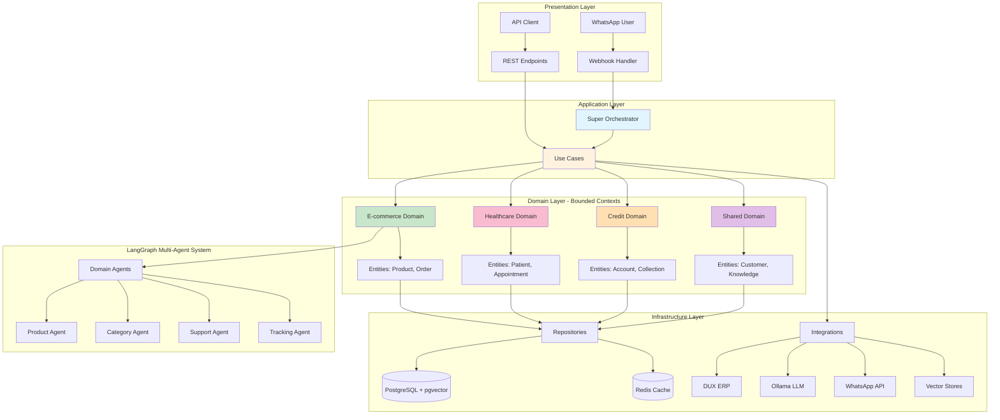

# 🤖 Aynux

> Multi-domain WhatsApp bot platform powered by AI agents

**Aynux** is an intelligent, multi-domain conversational AI platform built for WhatsApp Business. It uses specialized AI agents to handle different business domains (e-commerce, healthcare, finance) in a single unified system, with support for custom domain configuration and RAG-based knowledge.

[](https://www.python.org/downloads/)
[](https://fastapi.tiangolo.com/)
[](https://langchain-ai.github.io/langgraph/)
[](LICENSE)

---

## 🌟 Key Features

### 🎯 Multi-Domain Intelligence
- **Domain Routing**: Automatically detects user intent and routes to specialized business domains
- **Configurable Agents**: Each domain has dedicated AI agents for specific tasks
- **Context Awareness**: Maintains conversation context across multiple interactions
- **RAG-Enabled**: Semantic search over domain-specific knowledge bases

### 🏢 Supported Business Domains

#### 🛍️ E-commerce
- Product catalog search and recommendations
- Order tracking and status updates
- Customer support and FAQ
- Promotions and discount queries

#### 🏥 Healthcare (Hospital)
- Patient record management
- Appointment scheduling
- Medical information queries
- Doctor availability checks

#### 💰 Finance (Credit)
- Account balance inquiries
- Collection management
- Payment processing
- Transaction history

### 🔧 Technical Capabilities
- **Multi-Agent Architecture**: Powered by LangGraph for sophisticated conversation flows
- **Vector Search**: pgvector + ChromaDB for semantic search capabilities
- **Real-time Processing**: Async architecture for high-performance message handling
- **External Integrations**: DUX ERP, WhatsApp Business API, Ollama AI
- **Monitoring**: LangSmith tracing and Sentry error tracking
- **Caching**: Multi-layer Redis cache for optimized performance

---

## 🚀 Quick Start

### Prerequisites

- Python 3.13+
- PostgreSQL 14+ with pgvector extension
- Redis 7+
- Ollama (for local LLM inference)
- WhatsApp Business API account (optional)

### Installation

1. **Clone the repository**
   ```bash
   git clone https://github.com/your-username/aynux.git
   cd aynux
   ```

2. **Install UV package manager** (recommended)
   ```bash
   curl -LsSf https://astral.sh/uv/install.sh | sh
   ```

3. **Install dependencies**
   ```bash
   uv sync
   ```

4. **Configure environment**
   ```bash
   cp .env.example .env
   # Edit .env with your configuration
   ```

5. **Setup database**
   ```bash
   # Install pgvector extension
   psql -h localhost -U your_user -d aynux -c "CREATE EXTENSION IF NOT EXISTS vector;"

   # Run migrations
   psql -h localhost -U your_user -d aynux -f app/scripts/migrations/001_add_pgvector_support.sql
   ```

6. **Start Ollama and pull models**
   ```bash
   ollama pull deepseek-r1:7b
   ollama pull nomic-embed-text
   ```

7. **Run the development server**
   ```bash
   ./dev-uv.sh
   # Or manually:
   uv run uvicorn app.main:app --reload --host 0.0.0.0 --port 8000
   ```

8. **Access the API**
   - API Documentation: http://localhost:8000/docs
   - Health Check: http://localhost:8000/health

---

## 💬 Usage Examples

### Chat via API

```python
import requests

response = requests.post(
    "http://localhost:8000/api/v1/chat/message",
    json={
        "user_id": "user_123",
        "message": "¿Tienen laptops disponibles?",
        "session_id": "session_456"
    }
)

print(response.json())
# {
#   "response": "Sí, tenemos varias laptops disponibles. Te muestro algunas opciones...",
#   "agent_used": "product_agent",
#   "processing_time_ms": 1234
# }
```

### WhatsApp Integration

```python
# Configure webhook in your .env
WHATSAPP_ACCESS_TOKEN=your_token
WHATSAPP_PHONE_NUMBER_ID=your_phone_id
WHATSAPP_VERIFY_TOKEN=your_verify_token

# The webhook endpoint automatically handles incoming WhatsApp messages
# POST /webhook
```

### Domain-Specific Queries

```python
# E-commerce domain
"¿Cuánto cuesta la laptop ASUS ROG?"
# → Routes to ProductAgent → Returns product details with price

# Healthcare domain
"Necesito agendar una cita con el Dr. García"
# → Routes to HospitalDomainService → Appointment scheduling flow

# Finance domain
"¿Cuál es mi saldo actual?"
# → Routes to CreditDomainService → Account balance query
```

### Using the New Clean Architecture

#### Use Cases (Business Operations)

```python
from app.core.container import DependencyContainer
from app.domains.ecommerce.application.use_cases import SearchProductsUseCase

# Get Use Case from DependencyContainer
container = DependencyContainer()
search_products_uc = container.create_search_products_use_case()

# Execute Use Case
result = await search_products_uc.execute(
    query="laptop gaming",
    limit=5
)

# result = SearchProductsResult(
#     products=[...],
#     total_count=42,
#     search_type="vector_similarity"
# )
```

#### Dependency Injection

```python
from fastapi import Depends
from app.api.dependencies import get_search_products_use_case
from app.domains.ecommerce.application.use_cases import SearchProductsUseCase

@router.get("/products/search")
async def search_products(
    query: str,
    use_case: SearchProductsUseCase = Depends(get_search_products_use_case)
):
    """FastAPI automatically injects Use Case via DependencyContainer"""
    result = await use_case.execute(query=query)
    return result
```

#### Repository Pattern

```python
from app.domains.ecommerce.application.ports import IProductRepository
from app.domains.ecommerce.infrastructure.repositories import ProductRepository

# Depend on abstraction (IProductRepository), not concrete implementation
class SearchProductsUseCase:
    def __init__(self, repository: IProductRepository):
        self.repository = repository  # Protocol (interface)

    async def execute(self, query: str):
        # Business logic uses abstract interface
        products = await self.repository.search_by_query(query)
        return products
```

---

## 📚 Documentation

### Core Documentation
- **[CLAUDE.md](CLAUDE.md)**: Development guide for Claude Code AI with Clean Architecture principles
- **[docs/FINAL_MIGRATION_SUMMARY.md](docs/FINAL_MIGRATION_SUMMARY.md)**: ⭐ Clean Architecture migration complete guide
- **[docs/LangGraph.md](docs/LangGraph.md)**: Complete LangGraph architecture guide
- **[docs/TESTING_GUIDE.md](docs/TESTING_GUIDE.md)**: Testing strategy and best practices
- **[docs/PGVECTOR_MIGRATION.md](docs/PGVECTOR_MIGRATION.md)**: Vector search implementation

### Quick References
- **[QUICKSTART_TESTING.md](docs/QUICKSTART_TESTING.md)**: Quick testing setup
- **[IMPLEMENTATION_SUMMARY.md](docs/IMPLEMENTATION_SUMMARY.md)**: Technical implementation details
- **[PHASE_4_COMPLETION_SUMMARY.md](docs/PHASE_4_COMPLETION_SUMMARY.md)**: Recent enhancements

---

## 🏗️ Architecture Overview

### Clean Architecture with DDD

Aynux follows **Clean Architecture** principles with **Domain-Driven Design** (DDD), ensuring scalability, testability, and maintainability.



### Clean Architecture Layers

#### 1. **Domain Layer** (`app/domains/`)
Core business logic independent of frameworks and external systems.

- **Bounded Contexts**: `ecommerce/`, `healthcare/`, `credit/`, `shared/`
- **Entities**: Business objects with identity (`Product`, `Customer`, `Order`)
- **Value Objects**: Immutable objects without identity (`Price`, `Email`)
- **Domain Services**: Domain-specific business logic
- **Domain Events**: Business events for cross-domain communication

#### 2. **Application Layer** (`app/domains/*/application/`)
Use Cases that orchestrate domain logic.

- **Use Cases**: Business operations (`SearchProductsUseCase`, `CreateOrderUseCase`)
- **DTOs**: Data Transfer Objects for input/output
- **Ports (Interfaces)**: Abstract interfaces using Python `Protocol`

#### 3. **Infrastructure Layer** (`app/domains/*/infrastructure/`, `app/integrations/`)
External systems, databases, and integrations.

- **Repositories**: Data access implementations (`ProductRepository`)
- **External Services**: API clients (`DuxApiClient`, `WhatsAppService`)
- **Vector Stores**: Semantic search (`PgVectorService`, `ChromaDBService`)
- **LLM Integration**: AI models (`OllamaLLM`)

#### 4. **Presentation Layer** (`app/api/`)
User interfaces and API endpoints.

- **REST API**: FastAPI endpoints with dependency injection
- **Webhooks**: WhatsApp Business API integration
- **GraphQL** (planned): Alternative API interface

### Key Architectural Patterns

- **SOLID Principles**: All code follows Single Responsibility, Open/Closed, Liskov Substitution, Interface Segregation, Dependency Inversion
- **Dependency Injection**: `DependencyContainer` wires all dependencies
- **Repository Pattern**: Abstracts data access with `IRepository` protocol
- **Use Case Pattern**: Each business operation is a separate Use Case
- **Protocol (Interfaces)**: Runtime-checkable interfaces for loose coupling
- **Multi-Agent System**: LangGraph orchestrates specialized AI agents
- **Event-Driven**: Domain events for cross-domain communication (planned)

### Directory Structure

```
app/
├── domains/                    # Domain Layer (DDD Bounded Contexts)
│   ├── ecommerce/             # E-commerce domain
│   │   ├── domain/            # Entities, Value Objects, Domain Services
│   │   │   ├── entities/      # Product, Order, Category
│   │   │   ├── value_objects/ # Price, Discount, SKU
│   │   │   └── services/      # Domain business logic
│   │   ├── application/       # Use Cases and DTOs
│   │   │   ├── use_cases/     # SearchProductsUseCase, CreateOrderUseCase
│   │   │   ├── dto/           # Request/Response DTOs
│   │   │   └── ports/         # Interfaces (IProductRepository)
│   │   └── infrastructure/    # Repositories, External Services
│   │       ├── repositories/  # ProductRepository, OrderRepository
│   │       ├── persistence/   # SQLAlchemy, Redis implementations
│   │       └── services/      # DuxSyncService, ScheduledSyncService
│   ├── healthcare/            # Healthcare domain (same structure)
│   ├── credit/                # Credit domain (same structure)
│   └── shared/                # Shared domain (Customer, Knowledge)
│       └── application/use_cases/  # GetOrCreateCustomerUseCase
│
├── integrations/              # Infrastructure - External Systems
│   ├── llm/                   # Ollama LLM, AI Data Pipeline
│   ├── vector_stores/         # PgVector, ChromaDB, Embeddings
│   ├── whatsapp/              # WhatsApp Business API
│   ├── databases/             # Database connectors
│   └── monitoring/            # LangSmith, Sentry
│
├── core/                      # Core shared infrastructure
│   ├── interfaces/            # IRepository, ILLM, IVectorStore (Protocols)
│   ├── container.py           # DependencyContainer (DI)
│   ├── shared/                # Shared utilities
│   │   ├── deprecation.py     # @deprecated decorator
│   │   ├── prompt_service.py  # Prompt management
│   │   └── utils/             # Phone normalizer, data extraction
│   └── config/                # Settings, environment variables
│
├── orchestration/             # Super Orchestrator (multi-domain routing)
│   └── super_orchestrator.py  # Routes to domain Use Cases
│
├── api/                       # Presentation Layer (FastAPI)
│   ├── routes/                # REST endpoints
│   ├── dependencies.py        # FastAPI dependency injection
│   └── middleware/            # Auth, logging, CORS
│
├── agents/                    # LangGraph multi-agent system
│   ├── subagent/              # Specialized agents (ProductAgent, etc.)
│   ├── routing/               # Agent routing logic
│   └── schemas/               # Agent state schemas
│
└── services/                  # Legacy services (deprecated)
    ├── [9 deprecated services with @deprecated decorator]
    └── langgraph/             # LangGraph infrastructure services
```

### Benefits of This Architecture

✅ **Testability**: Each layer can be tested independently
✅ **Maintainability**: Clear separation of concerns (SOLID principles)
✅ **Scalability**: Easy to add new domains or features
✅ **Flexibility**: Swap implementations without changing business logic
✅ **Domain Focus**: Business logic is framework-independent
✅ **Team Collaboration**: Different teams can work on different domains

---

## 🧪 Testing

### Run the Test Suite

```bash
# All tests
uv run pytest -v

# Specific test categories
uv run pytest tests/test_pgvector_integration.py -v
uv run pytest tests/test_scenarios.py -v

# Interactive chat testing
python tests/test_chat_interactive.py

# Monitoring dashboard
streamlit run tests/monitoring_dashboard.py
```

### LangSmith Integration

All conversations are automatically traced in LangSmith for debugging and optimization:

1. Configure LangSmith in `.env`:
   ```bash
   LANGSMITH_API_KEY=your_api_key
   LANGSMITH_PROJECT=aynux-production
   LANGSMITH_TRACING_ENABLED=true
   ```

2. View traces at: https://smith.langchain.com

---

## 🛠️ Tech Stack

### Core Technologies
- **Python 3.13**: Modern Python with type hints
- **FastAPI**: High-performance async web framework
- **LangGraph**: Multi-agent conversation orchestration
- **LangChain**: LLM framework and integrations

### AI & Vector Search
- **Ollama**: Local LLM inference (deepseek-r1:7b)
- **pgvector**: PostgreSQL vector similarity search
- **ChromaDB**: Legacy semantic search (being phased out)
- **nomic-embed-text**: 1024-dimension embeddings

### Data & Caching
- **PostgreSQL 14+**: Primary database with pgvector extension
- **Redis 7+**: Multi-layer caching and session management
- **SQLAlchemy 2.0**: Async ORM

### Development Tools
- **UV**: Fast Python package manager
- **Black**: Code formatting
- **Ruff**: Fast Python linter
- **Pytest**: Testing framework

### Monitoring & Observability
- **LangSmith**: LLM observability and debugging
- **Sentry**: Error tracking and monitoring
- **Structured Logging**: JSON-formatted logs

---

## 🗺️ Roadmap

### ✅ Completed
- [x] Multi-domain architecture with super orchestrator
- [x] E-commerce domain with full agent support
- [x] Healthcare and finance domain foundations
- [x] pgvector integration for semantic search
- [x] LangSmith tracing and monitoring
- [x] Comprehensive testing suite

### 🚧 In Progress
- [ ] User-configurable RAG data uploads
- [ ] Enhanced healthcare domain agents
- [ ] Finance domain collection workflows
- [ ] Multi-language support (English, Portuguese)

### 📋 Planned
- [ ] Visual conversation flow editor
- [ ] Custom domain creation UI
- [ ] Advanced analytics dashboard
- [ ] Voice message support
- [ ] Multi-channel support (Telegram, Facebook Messenger)

---

## 🤝 Contributing

We welcome contributions! Please see our [Contributing Guide](CONTRIBUTING.md) for details.

### Development Setup

1. Fork the repository
2. Create a feature branch: `git checkout -b feature/amazing-feature`
3. Follow the **[SOLID principles](CLAUDE.md#code-quality--design-principles)** (especially SRP)
4. Write tests for new features
5. Ensure all tests pass: `uv run pytest -v`
6. Format code: `uv run black app && uv run isort app`
7. Commit changes: `git commit -m 'feat: Add amazing feature'`
8. Push to branch: `git push origin feature/amazing-feature`
9. Open a Pull Request

---

## 📄 License

This project is licensed under the MIT License - see the [LICENSE](LICENSE) file for details.

---

## 🙏 Acknowledgments

- **LangChain/LangGraph**: For the excellent multi-agent framework
- **FastAPI**: For the high-performance web framework
- **Ollama**: For making local LLM inference easy
- **pgvector**: For bringing vector search to PostgreSQL

---

## 📞 Support

- **Documentation**: See the [docs/](docs/) directory
- **Issues**: [GitHub Issues](https://github.com/your-username/aynux/issues)
- **Discussions**: [GitHub Discussions](https://github.com/your-username/aynux/discussions)

---

<div align="center">

**Built with ❤️ using AI-powered development**

[Report Bug](https://github.com/your-username/aynux/issues) • [Request Feature](https://github.com/your-username/aynux/issues) • [Documentation](docs/)

</div>
